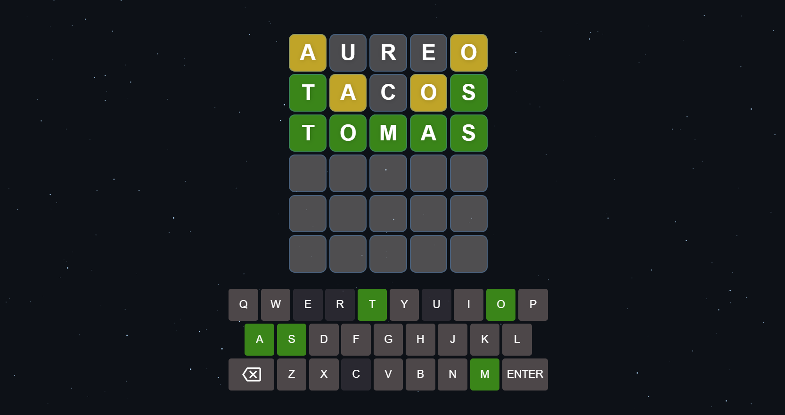

# Enigm

<strong>Enigm</strong> Você está pronto para um desafio cerebral empolgante? Bem-vindo ao "Desafio das Cinco Letras", uma aplicação de jogo de palavras que testará sua habilidade linguística e sua capacidade de dedução. Neste jogo intrigante, sua missão é descobrir a palavra secreta de exatamente cinco letras, utilizando apenas seis tentativas para acertar em cheio.

    

## Telas

    

